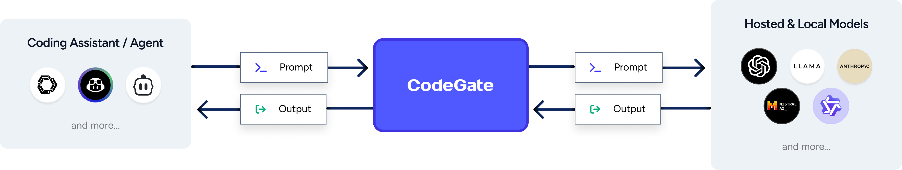
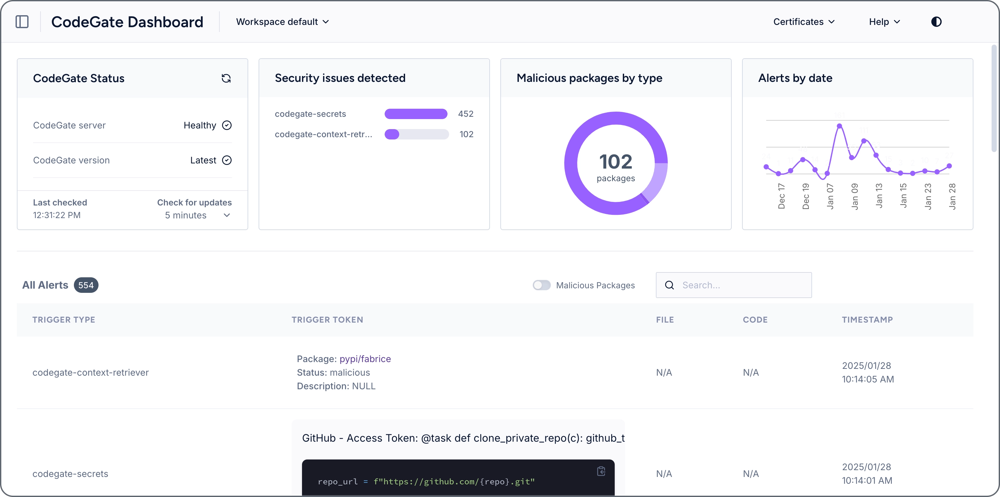

<picture>
  <source media="(prefers-color-scheme: dark)" srcset="./static/codegate-logo-white.svg">
  
</picture>

---

[](https://github.com/stacklok/codegate/releases)
|
[](https://github.com/stacklok/codegate/actions/workflows/run-on-push.yml)
|
[](https://opensource.org/licenses/Apache-2.0)
|
[](https://github.com/stacklok/codegate)
|
[](https://discord.gg/stacklok)

[Website](https://codegate.ai) | [Documentation](https://docs.codegate.ai) |
[YouTube](https://www.youtube.com/playlist?list=PLYBL38zBWVIhrDgKwAMjAwOYZeP-ZH64n)
| [Discord](https://discord.gg/stacklok)

---

# CodeGate: Security, Workspaces and Muxing for AI Applications, coding assistants, and agentic frameworks.

**By [Stacklok](https://stacklok.com)**

CodeGate is an agent designed to make AI applications, coding assistants and agentic frameworks, safer and easier to consume and manage. It provides a centralized, abstracted environment for managing prompts, model provider configurations, model muxing, and more. Additionally, CodeGate offers security analysis of AI-generated code, ensuring that recommendations follow best practices and safeguard your code's integrity.

With CodeGate, you can configure all your AI coding assistants and agents to use a single workspace
and benefit from a unified view of all the interactions between your AI coding assistants and your
models.

<picture>
  <source media="(prefers-color-scheme: dark)" srcset="./static/diagram-dark.png">
  
</picture>

---
## ✨ Why choose CodeGate?

AI coding assistants are powerful, but they can inadvertently introduce risks and configurations
can sprawl across multiple IDE extensions, plugins and agent systems. CodeGate simplifies the management of AI model and provider configurations and provides additional features to help you keep your development process safe.

- 🌐 Centralize and manage all your AI coding assistants in one place
- 🔄 Mux / Route prompts to different AI models based on workspaces or file types 
- 🔑 Centrally configure and manage your provider credentials and API keys
- 🛡️ Protect your development process from accidental exposure of secrets and sensitive personal data to the cloud
- 🔒 Ensure that the recommendations provided by your AI coding assistants follow secure coding practices
- 🚫 Prevent malicious or deprecated libraries from being recommended to you by an LLM

---
## 🚀 Quickstart

### Prerequisites

CodeGate is distributed as a Docker container. You need a container runtime like
Docker Desktop or Docker Engine. Podman and Podman Desktop are also supported.
CodeGate works on Windows, macOS, and Linux operating systems with x86_64 and
arm64 (ARM and Apple Silicon) CPU architectures.

These instructions assume the `docker` CLI is available. If you use Podman,
replace `docker` with `podman` in all commands.

### Installation

To start CodeGate, run this simple command:

```bash
docker run --name codegate -d -p 8989:8989 -p 9090:9090 -p 8990:8990 \
  --mount type=volume,src=codegate_volume,dst=/app/codegate_volume \
  --restart unless-stopped ghcr.io/stacklok/codegate:latest
```

That’s it! CodeGate is now running locally. 

### Get into action
Now it's time to configure your preferred AI coding assistant to use CodeGate
[See supported AI Coding Assistants and providers](#-supported-ai-coding-assistants-and-providers)

⚙️ For advanced configurations and parameter references, check out the
[CodeGate Install and Upgrade](https://docs.codegate.ai/how-to/install)
documentation.

---
## 🖥️ Dashboard

CodeGate includes a web dashboard that provides:

- A view of **security risks** detected by CodeGate
- A **history of interactions** between your AI coding assistant and your LLM

<picture>
  <source media="(prefers-color-scheme: dark)" srcset="./static/dashboard-dark.webp">
  
</picture>

### Accessing the dashboard

Open [http://localhost:9090](http://localhost:9090) in your web browser to
access the dashboard.

To learn more, visit the
[CodeGate Dashboard documentation](https://docs.codegate.ai/how-to/dashboard).

---
## 🔐 Features

### Workspace management

CodeGate allows you to create workspaces, each with its own set of AI
models, configurations, prompts and chat history to help you manage your AI application
and development environment more effectively. [Learn more](https://docs.codegate.ai/features/workspaces)

### Model Muxing

CodeGate lets you route traffic between multiple AI models using a configurable
model muxer. This feature is useful when you want to use different models for
different purposes, such as code generation, summarization, documentation, etc.
[Learn more](https://docs.codegate.ai/features/model-muxing)

### Secrets Redaction

CodeGate helps you protect sensitive information from being accidentally exposed
to AI models and third-party AI provider systems by redacting detected secrets
from your prompts.
[Learn more](https://docs.codegate.ai/features/secrets-encryption)

### Personal Identifiable Information (PII) detection and redaction

CodeGate helps you protect personal data from being accidentally exposed to AI
models and third-party AI provider systems by redacting detected PII from your prompts.

Should CodeGate sense that a prompt contains PII, such as credit card numbers, social security numbers, or other sensitive information, it will automatically redact the PII from the prompt before sending it to the AI model, to then unredact the response before sending it back to the client.

### Dependency risk awareness

LLMs’ knowledge cutoff date is often months or even years in the past. They
might suggest outdated, vulnerable, or non-existent packages (hallucinations),
exposing you and your users to security risks.

CodeGate scans direct, transitive, and development dependencies in your package
definition files, installation scripts, and source code imports that you supply
as context to an LLM.
[Learn more](https://docs.codegate.ai/features/dependency-risk)

### Security reviews

CodeGate performs security-centric code reviews, identifying insecure patterns
or potential vulnerabilities to help you adopt more secure coding practices.
[Learn more](https://docs.codegate.ai/features/security-reviews)

---
## 🤖 Supported AI coding assistants and providers

### [Aider](https://docs.codegate.ai/how-to/use-with-aider)

- **Local / self-managed:**
  - Ollama
- **Hosted:**
  - OpenAI and compatible APIs

🔥 Getting started with CodeGate and aider -
[watch on YouTube](https://www.youtube.com/watch?v=VxvEXiwEGnA)

### [Cline](https://docs.codegate.ai/how-to/use-with-cline)

- **Local / self-managed:**
  - Ollama
  - LM Studio
- **Hosted:**
  - Anthropic
  - OpenAI and compatible APIs

### [Continue](https://docs.codegate.ai/how-to/use-with-continue)

- **Local / self-managed:**
  - Ollama
  - llama.cpp
  - vLLM
- **Hosted:**
  - Anthropic
  - OpenAI and compatible APIs

### [GitHub Copilot](https://docs.codegate.ai/how-to/use-with-copilot)

- The Copilot plugin works with **Visual Studio Code (VS Code)** (JetBrains is
  coming soon!)

### OpenIntepreter

- **Local / self-managed:**
  - Ollama
- **Hosted:**
  - Anthropic
  - OpenAI and compatible APIs

---
## 🛡️ Privacy first

Unlike other tools, with CodeGate **your code never leaves your machine**.
CodeGate is built with privacy at its core:

- 🏠 **Everything stays local**
- 🚫 **No external data collection**
- 🔐 **No calling home or telemetry**
- 💪 **Complete control over your data**

---
## 🛠️ Development

Are you a developer looking to contribute? Dive into our technical resources:

- [Development guide](https://github.com/stacklok/codegate/blob/main/docs/development.md)
- [CLI commands and flags](https://github.com/stacklok/codegate/blob/main/docs/cli.md)
- [Configuration system](https://github.com/stacklok/codegate/blob/main/docs/configuration.md)
- [Logging system](https://github.com/stacklok/codegate/blob/main/docs/logging.md)

---
## 📜 License

CodeGate is licensed under the terms specified in the
[LICENSE file](https://github.com/stacklok/codegate/blob/main/LICENSE).

---
## 🌟 Support us

Love CodeGate? Starring this repository and sharing it with others helps
CodeGate grow 🌱

[](https://github.com/stacklok/codegate)

---
## 🤝 Contributing

We welcome contributions! Whether you're submitting bug reports, feature
requests, or code contributions, your input makes CodeGate better for everyone.
We thank you ❤️!

Start by reading our
[Contributor guidelines](https://github.com/stacklok/codegate/blob/main/CONTRIBUTING.md).

### Thank you!

<a href="https://github.com/stacklok/codegate/graphs/contributors">
  
</a>

Made with [contrib.rocks](https://contrib.rocks).

<!-- markdownlint-disable-file first-line-heading no-inline-html -->