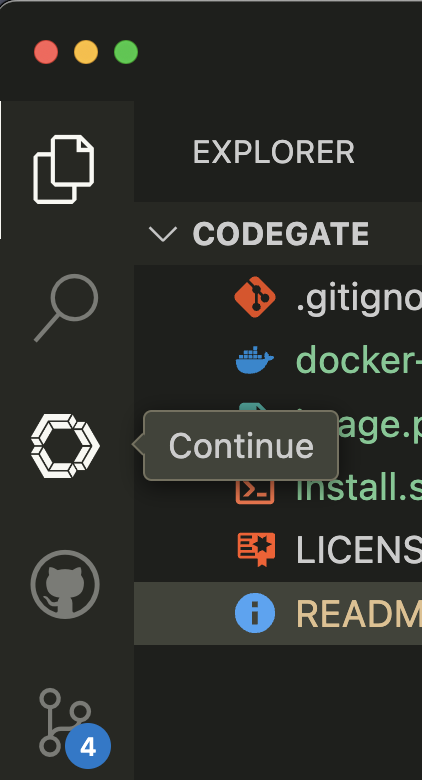

# CodeGate

### Installation

#### Requirements

- [Docker](https://docs.docker.com/get-docker/)
- [Docker Compose](https://docs.docker.com/compose/install/)
- [jq](https://stedolan.github.io/jq/download/)
- [vscode](https://code.visualstudio.com/download)

#### Steps

Download the installation script docker-compose.yml

Run the installation script

```bash
chmod +x install.sh && ./install.sh
```

The script will download the Continue VSCode extension, create
a configuration file. The script will also create a docker-compose.yml file and start the services.

### Usage

Tap the Continue button in the VSCode editor to start the service
to bring up a chat window. The chat window will be displayed in the
VSCode editor.




