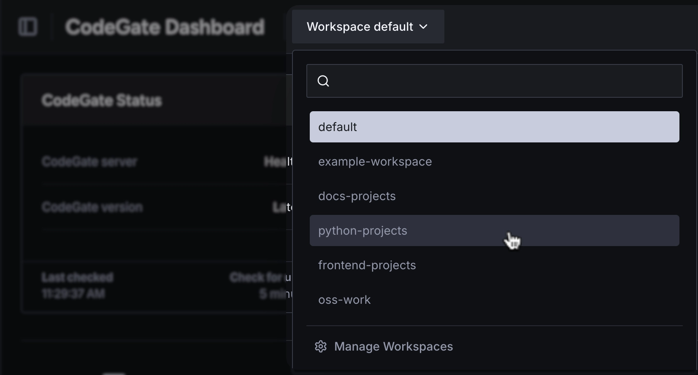
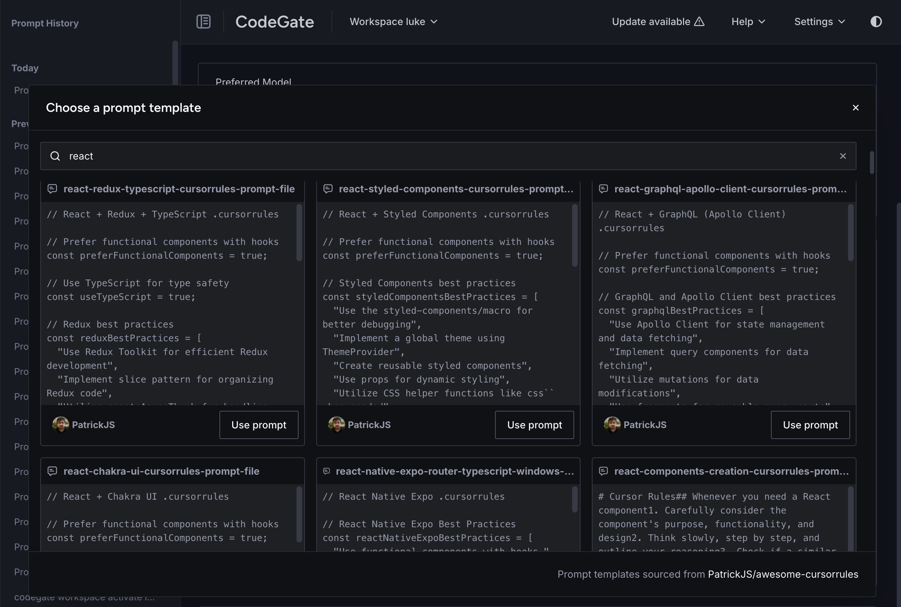
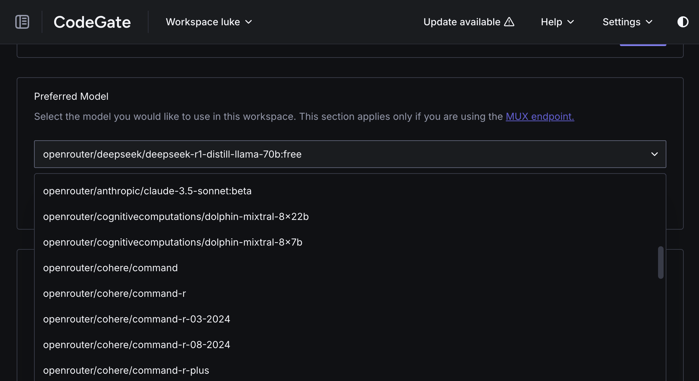

<picture>
  <source media="(prefers-color-scheme: dark)" srcset="./static/codegate-logo-white.svg">
  
</picture>

---

[](https://github.com/stacklok/codegate/releases)
|
[](https://github.com/stacklok/codegate/actions/workflows/run-on-push.yml)
|
[](https://opensource.org/licenses/Apache-2.0)
|
[](https://github.com/stacklok/codegate)
|
[](https://discord.gg/stacklok)

[Website](https://codegate.ai) | [Documentation](https://docs.codegate.ai) |
[YouTube](https://www.youtube.com/playlist?list=PLYBL38zBWVIhrDgKwAMjAwOYZeP-ZH64n)
| [Discord](https://discord.gg/stacklok)

---

# CodeGate: AI Development environments simplified.

**From [Stacklok](https://stacklok.com)**

CodeGate is the ultimate toolkit for developers using coding assistants to build AI applications. It streamlines multi-environment workflows, enabling you to consume AI with confidence from development to production. It empowers ongoing AI application management by optimizing model routing, prompt tracking and security enforcement, ensuring privacy, compliance, and robust operational integrity.

---

## CodeGate Architecture

<picture>
  <source media="(prefers-color-scheme: dark)" srcset="./static/diagram-dark.png">
  
</picture>


## 🚀 Why Developers Love CodeGate

AI unlocks new levels of productivity, but you need to use consume
with confidence. CodeGate helps you do just that, by providing a suite of
features that make AI development safe and efficient.

### Key Features

- **Workspaces**: Organize and personalize your AI tooling and environments.
- **Prompt & Alert History**: Track AI suggestions and security insights in one place.
- **Model Muxing**: Switch seamlessly between AI models per project or route
  specfic file types to a particular model or provider.
- **Custom Instructions**: Tailor your AI’s behavior to match your coding style,
  by providing custom prompts or instructions per project or workspace.
- **Prompt Database**: Leverage a growing collection of developer-contributed
  prompts or create and store your own, to make them available across all your
  projects and workspaces.

🔒 Built-in Security, Zero Effort

- **Secrets Protection**: Prevent sensitive data from leaking to AI cloud
  service providers.
- **Malicious Package Detection**: Block risky dependencies before they reach
  your code, using Stackloks free AI / ML inteligence threat detection pipeline.
- **Command Execution Monitoring**: Stop AI-generated shell commands from running
  unsafe actions within your agent or coding assistant.
- **PII Protection**: Prevent personally identifiable information from being
  exposed to AI cloud service providers, such as credit card numbers,
  social security numbers, and more.

---

## 🚀 Quickstart

### Prerequisites

CodeGate is distributed as a Docker container. You need a container runtime like
Docker Desktop or Docker Engine. Podman and Podman Desktop are also supported.
CodeGate works on Windows, macOS, and Linux operating systems with x86_64 and
arm64 (ARM and Apple Silicon) CPU architectures.

These instructions assume the `docker` CLI is available. If you use Podman,
replace `docker` with `podman` in all commands.

### Installation

To start CodeGate, run this simple command:

```bash
docker run --name codegate -d -p 8989:8989 -p 9090:9090 -p 8990:8990 \
  --mount type=volume,src=codegate_volume,dst=/app/codegate_volume \
  --restart unless-stopped ghcr.io/stacklok/codegate:latest
```

That’s it! CodeGate is now running locally. 

### Get into action
Now it's time to configure your preferred AI coding assistant to use CodeGate
[See supported AI Coding Assistants and providers](#-supported-ai-coding-assistants-and-providers)

⚙️ For advanced configurations and parameter references, check out the
[CodeGate Install and Upgrade](https://docs.codegate.ai/how-to/install)
documentation.

---
## 🖥️ Dashboard

CodeGate includes a web dashboard that provides:

- **Manage workspaces** and AI model / provider routing rules.
- **Track security risks** detected by CodeGate.
- **Manage project prompts** and apply them across all your projects and  
  workspaces.
- **History of interactions** between your AI coding assistant and your LLM.

<picture>
  <source media="(prefers-color-scheme: dark)" srcset="./static/dashboard-dark.webp">
  
</picture>

### Accessing the dashboard

Open [http://localhost:9090](http://localhost:9090) in your web browser to
access the dashboard.

To learn more, visit the
[CodeGate Dashboard documentation](https://docs.codegate.ai/how-to/dashboard).

---
## 🔐 Features

### Workspaces

<picture>
  <source media="(prefers-color-scheme: dark)" srcset="./static/workspace-light.png">
  
</picture>

Workspaces are a way to organize your AI tooling and environments. You can
create multiple workspaces to switch between them as needed. 

Workspaces can be used to:

- Switch between different AI models or providers.
- Apply different prompts or instructions to different projects.
- Isolate projects by applying different settings or rules.

Workspaces are then available within all the different AI coding assistants
and tools that CodeGate supports (i.e. Aider, Cline, Continue, Copilot, Open-Interpreter, etc.)

### Prompt Database

<picture>
  <source media="(prefers-color-scheme: dark)" srcset="./static/prompts-light.png">
  
</picture>

The Prompt Database is a collection of prompts that you can use across all your
projects and workspaces. You can also contribute your own prompts to the
database.

### Model Muxing

<picture>
  <source media="(prefers-color-scheme: dark)" srcset="./static/mux-light.png">
  
</picture>


Model Muxing is a feature that allows you to route different workspaces or
to different AI models or providers, even down the level of a single file.


### Secrets encryption

CodeGate helps you protect sensitive information from being accidentally exposed
to AI models and third-party AI provider systems by redacting detected secrets
from your prompts using encryption.
[Learn more](https://docs.codegate.ai/features/secrets-encryption)

### Dependency risk awareness

LLMs’ knowledge cutoff date is often months or even years in the past. They
might suggest outdated, vulnerable, or non-existent packages (hallucinations),
exposing you and your users to security risks.

CodeGate scans direct, transitive, and development dependencies in your package
definition files, installation scripts, and source code imports that you supply
as context to an LLM.
[Learn more](https://docs.codegate.ai/features/dependency-risk)

### Security reviews

CodeGate performs security-centric code reviews, identifying insecure patterns
or potential vulnerabilities to help you adopt more secure coding practices.
[Learn more](https://docs.codegate.ai/features/security-reviews)

---
## 🤖 Supported AI coding assistants and providers

### [Aider](https://docs.codegate.ai/how-to/use-with-aider)

- **Local / self-managed:**
  - Ollama
- **Hosted:**
  - OpenAI and compatible APIs

🔥 Getting started with CodeGate and aider -
[watch on YouTube](https://www.youtube.com/watch?v=VxvEXiwEGnA)

### [Cline](https://docs.codegate.ai/how-to/use-with-cline)

- **Local / self-managed:**
  - Ollama
  - LM Studio
- **Hosted:**
  - Anthropic
  - OpenAI and compatible APIs

### [Continue](https://docs.codegate.ai/how-to/use-with-continue)

- **Local / self-managed:**
  - Ollama
  - llama.cpp
  - vLLM
- **Hosted:**
  - Anthropic
  - OpenAI and compatible APIs

### [GitHub Copilot](https://docs.codegate.ai/how-to/use-with-copilot)

- The Copilot plugin works with **Visual Studio Code (VS Code)** (JetBrains is
  coming soon!)

---
## 🛡️ Privacy first

Unlike other tools, with CodeGate **your code never leaves your machine**.
CodeGate is built with privacy at its core:

- 🏠 **Everything stays local**
- 🚫 **No external data collection**
- 🔐 **No calling home or telemetry**
- 💪 **Complete control over your data**

---
## 🛠️ Development

Are you a developer looking to contribute? Dive into our technical resources:

- [Development guide](https://github.com/stacklok/codegate/blob/main/docs/development.md)
- [CLI commands and flags](https://github.com/stacklok/codegate/blob/main/docs/cli.md)
- [Configuration system](https://github.com/stacklok/codegate/blob/main/docs/configuration.md)
- [Logging system](https://github.com/stacklok/codegate/blob/main/docs/logging.md)

---
## 📜 License

CodeGate is licensed under the terms specified in the
[LICENSE file](https://github.com/stacklok/codegate/blob/main/LICENSE).

---
## 🌟 Support us

Love CodeGate? Starring this repository and sharing it with others helps
CodeGate grow 🌱

[](https://github.com/stacklok/codegate)

---
## 🤝 Contributing

We welcome contributions! Whether you're submitting bug reports, feature
requests, or code contributions, your input makes CodeGate better for everyone.
We thank you ❤️!

Start by reading our
[Contributor guidelines](https://github.com/stacklok/codegate/blob/main/CONTRIBUTING.md).

### Thank you!

<a href="https://github.com/stacklok/codegate/graphs/contributors">
  
</a>

Made with [contrib.rocks](https://contrib.rocks).

<!-- markdownlint-disable-file first-line-heading no-inline-html -->
